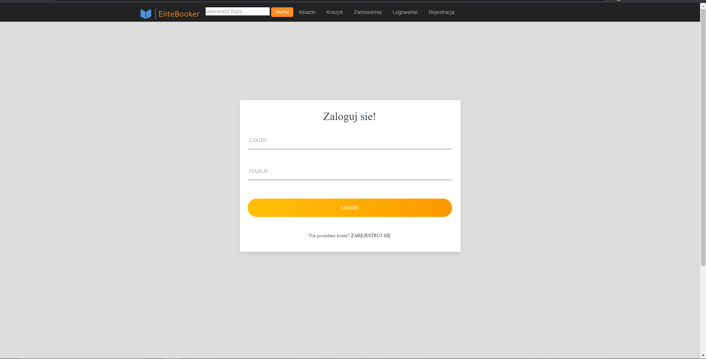

# EliteBooker
> EliteBooker is the most ordinary bookshop, where the customer creates an account, then gets access to see the available books. He can, of course, place an order, having first added it to his basket. Then, in the order tab, he can follow the progress of the order. The management of available books, users and orders is done by an employee who has admin rights.
## Table of contents
* [Screenshots](#screenshots)
* [Technologies](#technologies)
* [Status](#status)
* [Contact](#contact)
## Screenshots
view of main page:

Login form:

Register Form:

Available books:

Details about a book:

View after selecting the type of book:

View after entering the phrase:

View of cart without books:

 View of cart with books:

View of user orders:

View of order Details:

## Technologies

* ASP.NET MVC 5.2.7.0
* Jquery - version 3.4.1
* Bootstrap - version 3.4.1
* EntityFramework - version 6.2.0

## Status

Project is: _no longer continue_ 

## Contact

>Created by [Miko³aj Weso³ek](https://github.com/wesoly97)- feel free to contact me!
